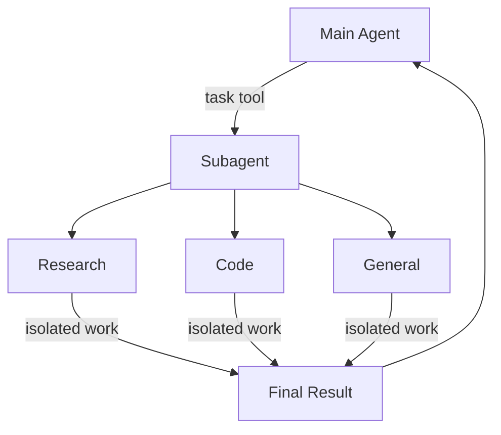

import SubagentBasic from '/snippets/subagent-basic.mdx';

Deep agents can create subagents to delegate work. You can specify custom subagents in the `subagents` parameter. Subagents are useful for [context quarantine](https://www.dbreunig.com/2025/06/26/how-to-fix-your-context.html#context-quarantine) (keeping the main agent's context clean) and for providing specialized instructions.



## Why use subagents?

Subagents solve the **context bloat problem**. When agents use tools with large outputs (web search, file reads, database queries), the context window fills up quickly with intermediate results. Subagents isolate this detailed work—the main agent receives only the final result, not the dozens of tool calls that produced it.

**When to use subagents:**
- ✅ Multi-step tasks that would clutter the main agent's context
- ✅ Specialized domains that need custom instructions or tools
- ✅ Tasks requiring different model capabilities
- ✅ When you want to keep the main agent focused on high-level coordination

**When NOT to use subagents:**
- ❌ Simple, single-step tasks
- ❌ When you need to maintain intermediate context
- ❌ When the overhead outweighs benefits

## Configuration

`subagents` should be a list of dictionaries or `CompiledSubAgent` objects. There are two types:

### SubAgent (Dictionary-based)

For most use cases, define subagents as dictionaries with the following fields:


| Field | Type | Description |
|-------|------|-------------|
| `name` | `str` | Required. Unique identifier for the subagent. The main agent uses this name when calling the `task()` tool. The subagent name becomes metadata for `AIMessage`s and for streaming, which helps to differentiate between agents. |
| `description` | `str` | Required. Description of what this subagent does. Be specific and action-oriented. The main agent uses this to decide when to delegate. |
| `system_prompt` | `str` | Required. Instructions for the subagent. Custom subagents must define their own. Include tool usage guidance and output format requirements.<br></br>Does not inherit from main agent. |
| `tools` | `list[Callable]` | Required. Tools the subagent can use. Custom subagents specify their own. Keep this minimal and include only what's needed.<br></br>Does not inherit from main agent. |
| `model` | `str` \| `BaseChatModel` | Optional. Overrides the main agent's model. Omit to use the main agent's model.<br></br>Inherits from main agent by default. You can pass either a model identifier string like `'openai:gpt-5'` (using the `'provider:model'` format) or a LangChain chat model object (`await initChatModel("gpt-5")` or `new ChatOpenAI({ model: "gpt-5" })`). |
| `middleware` | `list[Middleware]` | Optional. Additional middleware for custom behavior, logging, or rate limiting.<br></br>Does not inherit from main agent. |
| `interrupt_on` | `dict[str, bool]` | Optional. Configure [human-in-the-loop](/oss/javascript/deepagents/human-in-the-loop) for specific tools. Subagent value overrides main agent. Requires checkpointer.<br></br>Inherits from main agent by default. Subagent value overrides the default. |
| `skills` | `list[str]` | Optional. [Skills](/oss/javascript/deepagents/skills) source paths. When specified, the subagent will load skills from these directories (e.g., `["/skills/research/", "/skills/web-search/"]`). This allows subagents to have different skill sets than the main agent.<br></br>Does not inherit from main agent. Only the general-purpose subagent inherits the main agent's skills. When a subagent has skills, it runs its own independent `SkillsMiddleware` instance. Skill state is fully isolated—a subagent's loaded skills are not visible to the parent, and vice versa. |


### CompiledSubAgent

For complex workflows, use a prebuilt LangGraph graph:

| Field | Type | Description |
|-------|------|-------------|
| `name` | `str` | Required. Unique identifier for the subagent. The subagent name becomes metadata for `AIMessage`s and for streaming, which helps to differentiate between agents. |
| `description` | `str` | Required. What this subagent does. |
| `runnable` | `Runnable` | Required. A compiled LangGraph graph (must call `.compile()` first). |

## Using SubAgent

<SubagentBasic />

## Using CompiledSubAgent

For more complex use cases, you can provide your custom subagents.
You can create a custom subagent using LangChain's `create_agent` or by making a custom LangGraph graph using the [graph API](/oss/javascript/langgraph/graph-api).

If you're creating a custom LangGraph graph, make sure that the graph has a [state key called `"messages"`](/oss/javascript/langgraph/quickstart#2-define-state):


```typescript
import { createDeepAgent, CompiledSubAgent } from "deepagents";
import { createAgent } from "langchain";

// Create a custom agent graph
const customGraph = createAgent({
  model: yourModel,
  tools: specializedTools,
  prompt: "You are a specialized agent for data analysis...",
});

// Use it as a custom subagent
const customSubagent: CompiledSubAgent = {
  name: "data-analyzer",
  description: "Specialized agent for complex data analysis tasks",
  runnable: customGraph,
};

const subagents = [customSubagent];

const agent = createDeepAgent({
  model: "claude-sonnet-4-6",
  tools: [internetSearch],
  systemPrompt: researchInstructions,
  subagents: subagents,
});
```


## Streaming

When streaming tracing information agents' names are available as `lc_agent_name` in metadata.
When reviewing tracing information, you can use this metadata to differentiate which agent the data came from.

The following example creates a deep agent with the name `main-agent` and a subagent with the name `research-agent`:

```python
import os
from typing import Literal
from tavily import TavilyClient
from deepagents import create_deep_agent

tavily_client = TavilyClient(api_key=os.environ["TAVILY_API_KEY"])

def internet_search(
    query: str,
    max_results: int = 5,
    topic: Literal["general", "news", "finance"] = "general",
    include_raw_content: bool = False,
):
    """Run a web search"""
    return tavily_client.search(
        query,
        max_results=max_results,
        include_raw_content=include_raw_content,
        topic=topic,
    )

research_subagent = {
    "name": "research-agent",
    "description": "Used to research more in depth questions",
    "system_prompt": "You are a great researcher",
    "tools": [internet_search],
    "model": "claude-sonnet-4-6",  # Optional override, defaults to main agent model
}
subagents = [research_subagent]

agent = create_deep_agent(
    model="claude-sonnet-4-6",
    subagents=subagents,
    name="main-agent"
)
```

As you prompt your deepagents, all agent runs executed by a subagent or deep agent will have the agent name in their metadata.
In this case the subagent with the name `"research-agent"`, will have `{'lc_agent_name': 'research-agent'}` in any associated agent run metadata:


## Structured output

All subagents support [structured ouput](/oss/javascript/langchain/structured-output) which you can use to validate the subagent's output.


You can set a desired structured output schema by passing it as the `responseFormat` argument to the call to `createAgent()`.
When the model generates the structured data, it’s captured and validated. The structured object itself is not returned to the parent agent.
When using structured output with subagents, include the structured data in the `ToolMessage`.


For more information, see [response format](/oss/javascript/langchain/structured-output#response-format).

## The general-purpose subagent

In addition to any user-defined subagents, deep agents have access to a `general-purpose` subagent at all times. This subagent:

- Has the same system prompt as the main agent
- Has access to all the same tools
- Uses the same model (unless overridden)
- Inherits skills from the main agent (when skills are configured)

### Override the general-purpose subagent


Include a subagent with `name: "general-purpose"` in your `subagents` list to replace the default. Use this to configure a different model, tools, or system prompt for the general-purpose subagent:

```typescript
import { createDeepAgent } from "deepagents";

// Main agent uses Claude; general-purpose subagent uses GPT
const agent = await createDeepAgent({
  model: "claude-sonnet-4-6",
  tools: [internetSearch],
  subagents: [
    {
      name: "general-purpose",
      description: "General-purpose agent for research and multi-step tasks",
      systemPrompt: "You are a general-purpose assistant.",
      tools: [internetSearch],
      model: "openai:gpt-4o",  // Different model for delegated tasks
    },
  ],
});
```


When you provide a subagent with the general-purpose name, the default general-purpose subagent is not added. Your spec fully replaces it.

### When to use it

The general-purpose subagent is ideal for context isolation without specialized behavior. The main agent can delegate a complex multi-step task to this subagent and get a concise result back without bloat from intermediate tool calls.

<Card title="Example">
    Instead of the main agent making 10 web searches and filling its context with results, it delegates to the general-purpose subagent: `task(name="general-purpose", task="Research quantum computing trends")`. The subagent performs all the searches internally and returns only a summary.
</Card>

### Skills inheritance

When configuring [skills](/oss/javascript/deepagents/skills) with `create_deep_agent`:

- **General-purpose subagent**: Automatically inherits skills from the main agent
- **Custom subagents**: Do NOT inherit skills by default—use the `skills` parameter to give them their own skills

<Note>
    Only subagents configured with skills get a `SkillsMiddleware` instance—custom subagents without a `skills` parameter do not. When present, skill state is fully isolated in both directions: the parent's skills are not visible to the child, and the child's skills are not propagated back to the parent.
</Note>


```typescript
import { createDeepAgent, SubAgent } from "deepagents";

// Research subagent with its own skills
const researchSubagent: SubAgent = {
  name: "researcher",
  description: "Research assistant with specialized skills",
  systemPrompt: "You are a researcher.",
  tools: [webSearch],
  skills: ["/skills/research/", "/skills/web-search/"],  // Subagent-specific skills
};

const agent = createDeepAgent({
  model: "claude-sonnet-4-6",
  skills: ["/skills/main/"],  // Main agent and GP subagent get these
  subagents: [researchSubagent],  // Gets only /skills/research/ and /skills/web-search/
});
```


## Best practices

### Write clear descriptions

The main agent uses descriptions to decide which subagent to call. Be specific:

✅ **Good:** `"Analyzes financial data and generates investment insights with confidence scores"`

❌ **Bad:** `"Does finance stuff"`

### Keep system prompts detailed

Include specific guidance on how to use tools and format outputs:


```typescript
const researchSubagent = {
  name: "research-agent",
  description: "Conducts in-depth research using web search and synthesizes findings",
  systemPrompt: `You are a thorough researcher. Your job is to:

  1. Break down the research question into searchable queries
  2. Use internet_search to find relevant information
  3. Synthesize findings into a comprehensive but concise summary
  4. Cite sources when making claims

  Output format:
  - Summary (2-3 paragraphs)
  - Key findings (bullet points)
  - Sources (with URLs)

  Keep your response under 500 words to maintain clean context.`,
  tools: [internetSearch],
};
```


### Minimize tool sets

Only give subagents the tools they need. This improves focus and security:


```typescript
// ✅ Good: Focused tool set
const emailAgent = {
  name: "email-sender",
  tools: [sendEmail, validateEmail],  // Only email-related
};

// ❌ Bad: Too many tools
const emailAgentBad = {
  name: "email-sender",
  tools: [sendEmail, webSearch, databaseQuery, fileUpload],  // Unfocused
};
```


### Choose models by task

Different models excel at different tasks:


```typescript
const subagents = [
  {
    name: "contract-reviewer",
    description: "Reviews legal documents and contracts",
    systemPrompt: "You are an expert legal reviewer...",
    tools: [readDocument, analyzeContract],
    model: "claude-sonnet-4-6",  // Large context for long documents
  },
  {
    name: "financial-analyst",
    description: "Analyzes financial data and market trends",
    systemPrompt: "You are an expert financial analyst...",
    tools: [getStockPrice, analyzeFundamentals],
    model: "gpt-5",  // Better for numerical analysis
  },
];
```


### Return concise results

Instruct subagents to return summaries, not raw data:


```typescript
const dataAnalyst = {
  systemPrompt: `Analyze the data and return:
  1. Key insights (3-5 bullet points)
  2. Overall confidence score
  3. Recommended next actions

  Do NOT include:
  - Raw data
  - Intermediate calculations
  - Detailed tool outputs

  Keep response under 300 words.`,
};
```


## Common patterns

### Multiple specialized subagents

Create specialized subagents for different domains:


```typescript
import { createDeepAgent } from "deepagents";

const subagents = [
  {
    name: "data-collector",
    description: "Gathers raw data from various sources",
    systemPrompt: "Collect comprehensive data on the topic",
    tools: [webSearch, apiCall, databaseQuery],
  },
  {
    name: "data-analyzer",
    description: "Analyzes collected data for insights",
    systemPrompt: "Analyze data and extract key insights",
    tools: [statisticalAnalysis],
  },
  {
    name: "report-writer",
    description: "Writes polished reports from analysis",
    systemPrompt: "Create professional reports from insights",
    tools: [formatDocument],
  },
];

const agent = createDeepAgent({
  model: "claude-sonnet-4-6",
  systemPrompt: "You coordinate data analysis and reporting. Use subagents for specialized tasks.",
  subagents: subagents,
});
```


**Workflow:**
1. Main agent creates high-level plan
2. Delegates data collection to data-collector
3. Passes results to data-analyzer
4. Sends insights to report-writer
5. Compiles final output

Each subagent works with clean context focused only on its task.

## Context management

When you invoke a parent agent with [runtime context](/oss/javascript/langchain/runtime), that context automatically propagates to all subagents. The parent's full `config` (including `context`) is passed through to each subagent invocation internally.

This means tools running inside any subagent can access the same context values you provided to the parent:


```typescript
import { createDeepAgent } from "deepagents";
import { tool } from "langchain";
import { z } from "zod";

const getUserData = tool(
  (input, config) => {
    const userId = config.context?.userId;
    return `Data for user ${userId}: ${input.query}`;
  },
  {
    name: "get_user_data",
    description: "Fetch data for the current user",
    schema: z.object({ query: z.string() }),
  }
);

const researchSubagent = {
  name: "researcher",
  description: "Conducts research for the current user",
  systemPrompt: "You are a research assistant.",
  tools: [getUserData],
};

const contextSchema = z.object({
  userId: z.string(),
  sessionId: z.string(),
});

const agent = createDeepAgent({
  model: "claude-sonnet-4-6",
  subagents: [researchSubagent],
  contextSchema,
});

// Context flows to the researcher subagent and its tools automatically
const result = await agent.invoke(
  { messages: [new HumanMessage("Look up my recent activity")] },
  { context: { userId: "user-123", sessionId: "abc" } },
);
```


### Per-subagent context

All subagents receive the same parent context. To pass configuration that is specific to a particular subagent, use **namespaced keys**: prefix context keys with the subagent's name:


```typescript
const result = await agent.invoke(
  { messages: [new HumanMessage("Research this and verify the claims")] },
  {
    context: {
      userId: "user-123",                        // shared by all agents
      "researcher:maxDepth": 3,                  // only for researcher
      "fact-checker:strictMode": true,           // only for fact-checker
    },
  },
);
```


Then read the relevant keys inside tools:


```typescript
const verifyClaim = tool(
  (input, config) => {
    const strictMode = config.context?.["fact-checker:strictMode"] ?? false;
    if (strictMode) {
      return strictVerification(input.claim);
    }
    return basicVerification(input.claim);
  },
  {
    name: "verify_claim",
    description: "Verify a factual claim",
    schema: z.object({ claim: z.string() }),
  }
);
```


### Identifying which subagent called a tool

When the same tool is shared between the parent and multiple subagents, you can use the `lc_agent_name` metadata (the same value used in [streaming](#streaming)) to determine which agent initiated the call:


```typescript
const sharedLookup = tool(
  (input, config) => {
    const agentName = config.metadata?.lc_agent_name;
    if (agentName === "fact-checker") {
      return strictLookup(input.query);
    }
    return generalLookup(input.query);
  },
  {
    name: "shared_lookup",
    description: "Look up information from various sources",
    schema: z.object({ query: z.string() }),
  }
);
```


You can combine both patterns—use namespaced context for agent-specific configuration and `lc_agent_name` metadata for branching tool behavior:


```typescript
const flexibleSearch = tool(
  (input, config) => {
    const agentName = config.metadata?.lc_agent_name ?? "unknown";
    const ctx = config.context ?? {};

    const maxResults = ctx[`${agentName}:maxResults`] ?? 5;
    const includeRaw = ctx[`${agentName}:includeRaw`] ?? false;

    return performSearch(input.query, { maxResults, includeRaw });
  },
  {
    name: "flexible_search",
    description: "Search with agent-specific settings",
    schema: z.object({ query: z.string() }),
  }
);
```


## Troubleshooting

### Subagent not being called

**Problem**: Main agent tries to do work itself instead of delegating.

**Solutions**:

1. **Make descriptions more specific:**


   ```typescript
   // ✅ Good
   { name: "research-specialist", description: "Conducts in-depth research on specific topics using web search. Use when you need detailed information that requires multiple searches." }

   // ❌ Bad
   { name: "helper", description: "helps with stuff" }
   ```


2. **Instruct main agent to delegate:**


   ```typescript
   const agent = createDeepAgent({
     systemPrompt: `...your instructions...

     IMPORTANT: For complex tasks, delegate to your subagents using the task() tool.
     This keeps your context clean and improves results.`,
     subagents: [...]
   });
   ```


### Context still getting bloated

**Problem**: Context fills up despite using subagents.

**Solutions**:

1. **Instruct subagent to return concise results:**


   ```typescript
   systemPrompt: `...

   IMPORTANT: Return only the essential summary.
   Do NOT include raw data, intermediate search results, or detailed tool outputs.
   Your response should be under 500 words.`
   ```


2. **Use filesystem for large data:**


   ```typescript
   systemPrompt: `When you gather large amounts of data:
   1. Save raw data to /data/raw_results.txt
   2. Process and analyze the data
   3. Return only the analysis summary

   This keeps context clean.`
   ```


### Wrong subagent being selected

**Problem**: Main agent calls inappropriate subagent for the task.

**Solution**: Differentiate subagents clearly in descriptions:


```typescript
const subagents = [
  {
    name: "quick-researcher",
    description: "For simple, quick research questions that need 1-2 searches. Use when you need basic facts or definitions.",
  },
  {
    name: "deep-researcher",
    description: "For complex, in-depth research requiring multiple searches, synthesis, and analysis. Use for comprehensive reports.",
  }
];
```

---

<div className="source-links">
<Callout icon="edit">
    [Edit this page on GitHub](https://github.com/langchain-ai/docs/edit/main/src/oss/deepagents/subagents.mdx) or [file an issue](https://github.com/langchain-ai/docs/issues/new/choose).
</Callout>
<Callout icon="terminal-2">
    [Connect these docs](/use-these-docs) to Claude, VSCode, and more via MCP for real-time answers.
</Callout>
</div>
